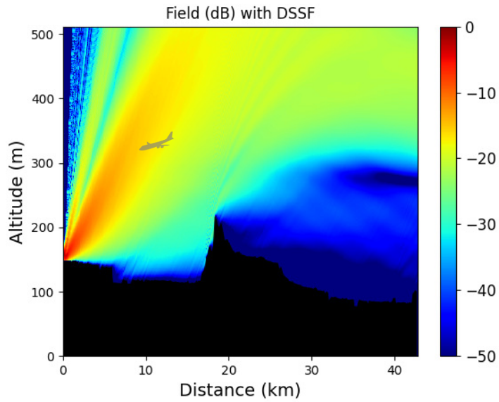

<h2><B>Associate-Professor at ENSTA Bretagne</B></h2>

I have been an associate professor at <a href="https://www.ensta-bretagne.fr/fr">ENSTA (Brest)</a> since September 2021. I am a member of the <a href="https://labsticc.fr/fr/equipes/pim">PIM</a> (Propagation et Interaction Multi-échelle) team of the <a href="https://labsticc.fr/fr">Lab-STICC</a>.

 My main research interests are numerical methods for electromagnetic applications and inverse problems. In particular, I focus on the following topics :
<ul>
  <li>Computational techniques in electromagnetics (Asymptotic and Rigorous methods, Machine Learning based algorithm)</li>
  <li>Modeling wave propagation</li>
  <li>Multi-physic and multi-scale modeling (electroporation, cold plasma)</li>
  <li>Inverse Scattering</li>
</ul>

<h2><B>Short biography</B></h2>
I was born in Pau in 1994. I graduated as an Electronics and Telecommunication engineer in 2017 from <a href="https://www.enac.fr/fr">ENAC</a> (Ecole Nationale de l’Aviation Civile) in Toulouse, France. I also obtained an <a href="https://m2rit-ro.recherche.enac.fr/">M.Sc. in Operational Research</a> the same year from the <a href="https://www.univ-tlse3.fr/">University of Toulouse 3 (Paul Sabatier)</a>. I then received a Ph.D. in Electromagnetism in 2020 from the <a href="https://www.univ-tlse3.fr/">University of Toulouse 3 (Paul Sabatier)</a>, France.
 
 During my thesis in the Electromagnetism and Antennas (<a href="https://ema.recherche.enac.fr/">EMA</a>) research axis of the TELECOM team at <a href="https://www.enac.fr/fr">ENAC</a>, I worked on modeling the propagation in 3D inhomogeneous atmosphere using split-step method. The main goal was to develop a fast, memory-efficient, and accurate wavelet-based method for tropospheric long-range propagation.
 
 I was then enrolled as a junior lecturer at the <a href="https://www.univ-pau.fr/fr/index.html">University of Pau</a>, France, between September 2020 and 2021. This year, I focused on electromagnetic models and numerical methods for plasma and bio-electromagnetism. This research aims at modeling the electroporation phenomena and efficiently solving the obtained PDEs and was done in the <a href="https://siame.univ-pau.fr/fr/organisation/equipes/equipe-procedes-haute-tension.html">SIAME PHT team</a>.
 
 Since September 2021 I am an associate professor at <a href="https://www.ensta-bretagne.fr/fr">ENSTA (Brest)</a>. My research mainly focuses on computational electromagnetics from radio-frequency to electro-quasi-static problems. I am thus a member of the <a href="https://labsticc.fr/fr/equipes/pim">PIM team</a> within the <a href="https://labsticc.fr/fr">Lab-STICC</a>. I am also an IEEE, a GRSS, and a URSI-France Member.
 
 I received a <a href="https://ursi.org/young_scientists.php">Young Scientist Award</a> at the URSI GASS 2021 meeting in Rome and at the URSI AT-RASC 2024 conference in Gran Canaria.
 
 
<!---->

